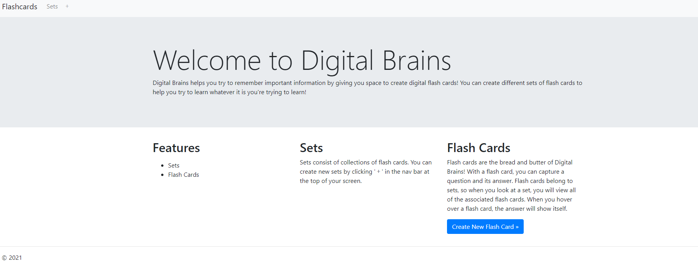
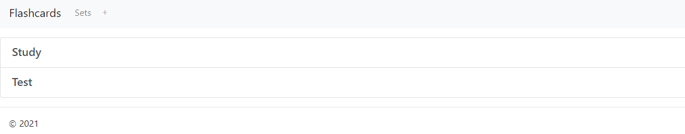
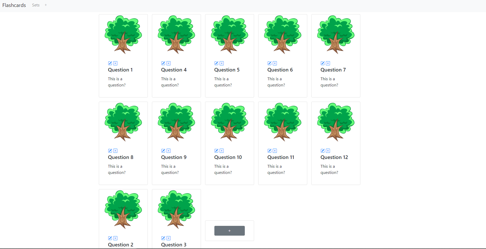
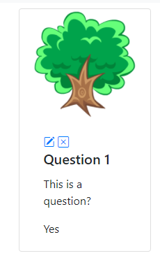
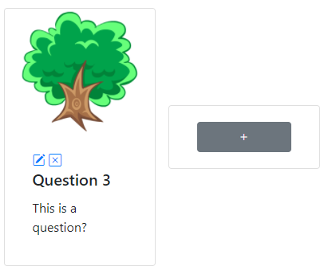
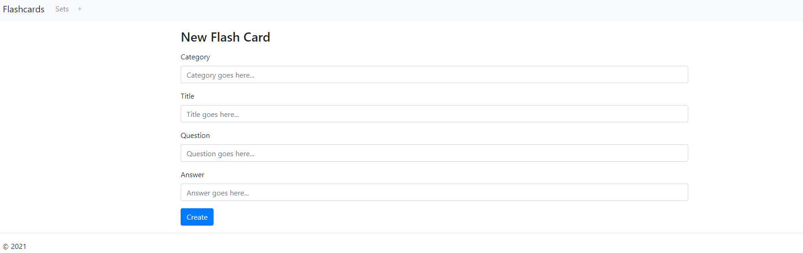

# Digital Brains

Digital Brains is a web application that allows you to create sets of flash cards to help you reinfornce learning.

***

## Technologies

Digital Brains was developed using NodeJS, Express and MongoDB.

The following NPM packages are required for this application to work:

* express: [https://www.npmjs.com/package/express](https://www.npmjs.com/package/express)
* mongoose: [https://www.npmjs.com/package/mongoose](https://www.npmjs.com/package/mongoose)
* ejs: [https://www.npmjs.com/package/ejs](https://www.npmjs.com/package/ejs)
* dotenv: [https://www.npmjs.com/package/dotenv](https://www.npmjs.com/package/dotenv)

These packages can be installed by running the following NPM command:
```
npm i express ejs mongoose dotenv
```


A .env file will also need to be created that contains the following key/value pairs:
```
MONGO_DB_URL=mongodb://<your_url_here>
STATIC_DIRECTORY=<name_of_your_static_content_directory>
WEBSERVER_URL=<webserver_host_url>
WEBSERVER_PORT=<webserver_port_number>
```

***

### Home Page:
The home page gives you some details on how to use the application



***

### Flash Cards Page:
A set is a collection of flash cards.  When you click the 'Sets' tab in the nav bar, you will be able to view all of the flashcards in a specific set.



***

### Flash Cards Page:
When you click one of the 'Sets' categories, you'll be able to view all of the flash cards you've created for that set.



***

### Hover Over Flash Card:
When you hover over a flash card, you will be shown the answer to the question posed on that card.  There are also 2 actions that you can perform for each card: update and delete.  By clicking the pencil icon, you can edit an existing flash card.  By clicking the 'x' icon, you can delete a flash card from the current category.



### Create new Flash Card:
At the end of all of the flash cards is an empty card with a '+' icon.  If you click that button, you'll be presented with a form to create a new flash card.



### New Flash Card Form:
The new flash card form is where you input all of the needed data to create your new flash card!

